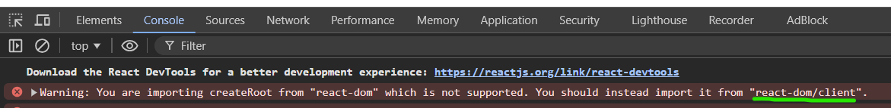
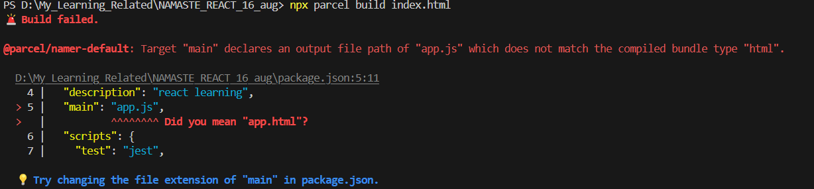
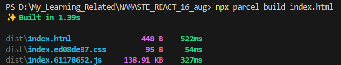
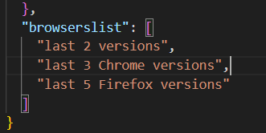

## REACT

#### What i studied till now

 - Hello world
 - hello world - using JS
 - hello world - using React & ReactDOM (using CDN)
  (
    `<script crossorigin src="https://unpkg.com/react@18/umd/react.development.js"></script>`
    `<script crossorigin src="https://unpkg.com/react-dom@18/umd/react-dom.development.js"></script>`
  )
  Get CDN links from here (`https://legacy.reactjs.org/docs/cdn-links.html`)
 - We learnt how to bring React on our code
 - We extracted same code on `app.js` file
 - We learnt that any created react element is an object - **h1** (`const h1 = React.createElement(
  "h1",{}, "I am H1")`)
 - And after render it becomes HTML element (`root.render(parent);`)
 - **createElement** takes 3 argument - `React.createElement("h2", {id:"new_h2"}, "Text or child element"),`
   1. Tag
   2. attributes as object
   3. text or child elements
  (If we have to give multiple children we need to pass as an array)
    ```
    React.createElement("div", { id: "child" }, [
    React.createElement("h1", {}, "parent -> child > h1 -> I am h1"),
    React.createElement("h2", {}, "parent -> child > h1 -> I am h2"),
    ])
    ```
  - On `root.render` it is replacing all the previous texts or child of root
  - We can use react just in small portion of our app (like header or footer or even card) 

### NPM

*npm not stands for Node Package Manager*
(It manages packages for project but not stand like that)

- `npm init` ()
  *This will ask many things*
  - package name (any name of project you are creating)
  - version (default 1.0.0)
  - description (any description)
  - entry point (like app.js)
  - test command (like jest)
  - git repoistory (on my it shows my already added repo - https://github.com/ajaydewangan1100/React_using_CDN_only.git)
  - keywords (any keyword, no need to put)
  - author (name of the person who is working on project)
  - license (ISC) (no need to put)
  - IS this OK? (yes) (enter)
  
### BUNDLER
*Bundeles the app/package *
example
- webpack (use by - create-react-app)
- parcel (easy to configure)
- vite

*I will use `parcel`*, **Comes as a node package**

Process

- `npm install -D parcel` (installed as dev dependencies)

2 types of dependencies are there

  1. **dev dependencies** - require under development
  2. Normal dependencies used in production also


- I can see devDependencies on package.json -
  ```
  "devDependencies": {
    "parcel": "^2.12.0"
  }
  ```
  *On version `^2.12.0` what is the meaning of **caret(^)** symbol*
  *Sometime it will be **tilde(~)** like - `~2.12.0`

  **caret(^)** - with this, npm will automatically do update on package if minor update will come (`2.12.0` -> `2.12.1`)

  **tilde(~)** - with this, npm will automatically do update on package if minor update will come and also for major updates (`2.12.0` -> `3.0.0`)
  
- A file also created - `package-lock.json`
  (This file keeps track of exact version installed on package)
  (*I serached parcel under `package-lock.json` and saw exact version of parcel along with integrity hash*)

- **node-modules** also created contains dependecies/packages which needs for parcel (or we can say parcel also have other dependencies)
  (We call that dependencies - **transitive dependencies**)

- Created a `.gitignore` and put names of files no need to push on github

- we don't need to push node-modules because we can install all dependencies just by running - `npm install`

### Igniting (Bundeling) the app

- `npx parcel index.html` (iginiting using parcel, we need to give source file name)
  - `npm` - means installing the packages
  - `npx` - means executing the package (so here I executed parcel)

- I am able to see on console it gives server url - `Server running at http://localhost:1234`

(Using CDN links on project is bad thing, it can take much time, i have used for `react` and `reactDOM`)
(*So we need to install them*)

### Installing REACT

- `npm install react`
- `npm install react-dom`

*We can see on package.json*
```
"dependencies": {
    "react": "^18.3.1",
    "react-dom": "^18.3.1"
  }
```
- Now I need to remove CDN links added under `index.html` for react and reactDOM and can directly use them from `node_modules`
- I need to import React and ReactDOM - 
  - import React from "react";
  - import ReactDOM from "react-dom"; 
  
- Now after running - `npx parcel index.html` I got an error -
```
Error: Expected content key de1e4a02ec63c4eb to exist

    at nullthrows (F:\react\node_modules\nullthrows\nullthrows.js:7:15)
    at AssetGraph.getNodeIdByContentKey (F:\react\node_modules\@parcel\graph\lib\ContentGraph.js:67:38)
    at F:\react\node_modules\@parcel\core\lib\SymbolPropagation.js:52:82
    at Array.map (<anonymous>)
    at propagateSymbols (F:\react\node_modules\@parcel\core\lib\SymbolPropagation.js:52:61)
    at AssetGraphBuilder.build (F:\react\node_modules\@parcel\core\lib\requests\AssetGraphRequest.js:168:62)
    at async Object.run (F:\react\node_modules\@parcel\core\lib\requests\AssetGraphRequest.js:60:37)
    at async RequestTracker.runRequest (F:\react\node_modules\@parcel\core\lib\RequestTracker.js:633:20)
    at async Object.run (F:\react\node_modules\@parcel\core\lib\requests\BundleGraphRequest.js:103:11)
    at async RequestTracker.runRequest (F:\react\node_modules\@parcel\core\lib\RequestTracker.js:633:20)


```
**SOLUTION** - I solved from this stack overflow page - 
`https://stackoverflow.com/questions/77166144/error-expected-content-key-de1e4a02ec63c4eb-to-exist-getting-this-error-in-reac`

*Auto delete script* -
```
"scripts": {
    "start": "rm -rf .parcel-cache && parcel",
    "build": "rm -rf .parcel-cache && parcel build"
  }
```
*I have updated my package.json script as* -
```
"scripts": {
    "test": "jest",
    "parcel": "rm -rf .parcel-cache && parcel index.html"
  },
```
**Now i can run** - `npm parcel` (It will delete cache file and then run `parcel index.html`)

-  (`@parcel/transformer-js: Browser scripts cannot have imports or exports.`)
  
  
*It is because `<script src="./app.js" ></script>` , saying app.js is normal js code*

**Answer we need to tell it is an module** - (Adding type="module")
`<script type="module" src="./app.js" ></script>`

- Now I am able to see a warning under console -
  

*This warning is because I need to import `ReactDOM` from `react-dom/client`* -> (`import ReactDOM from "react-dom/client";`)

### What parcel doing -

- Zero config tool
- Dev build
- Creating local server
- HMR - Hot Module Replacement (for refreeshing the web page)
- This things `parcel` doing by - File Watching Algorithm (Written in c++)
- Caching - Faster builds
- Image Optimization
- Minification of file
- Bundling
- Compressing files
- Consistent hashing ()
- Code spliting
- Differential Bundling (support older browsers also)
- Diagnostics
- Error handling
- HTTPs - (currently hosted on http - can give a way to host app on `HTTPs` )
- Tree Shaking - (Remove unused codes/functions)
- Different DEV and Production Bundle

**Learn Parcel** - [https://parceljs.org/](https://parceljs.org/)

- Now I done Production build with parcel using CMD - `npx parcel build index.html`
  
This commnad gives an error -


**Solution** - Removed `"main": "app.js",` this line from `package.json`
(basically this is conflicting the parcel, because parcel build starts from `index.html`, but `app.js` written under `package.json`)

- Now i run CMD - `npx parcel build index.html`
It created 3 major files under dist folder, (we can see) -

(*Our all project written codes contains by this files*, I can open ansd see that)

- We can give browsers list on `package.json` so our application will definitely work for that browsers

we can add list like this on `package.json`  -

```
"browserslist": [
  "last 2 versions",
  "last 3 Chrome versions",
  "last 5 Firefox versions"
]
```


for that we can use this browsers list *website* - [https://browserslist.dev/](https://browserslist.dev/)

- I have added 2 more script for `start` and `build` -
```
"scripts": {
  "start": "parcel index.html",
  "build": "parcel build index.html",
  "test": "jest",
  "parcel": "rm -rf .parcel-cache && parcel index.html"
}
```
