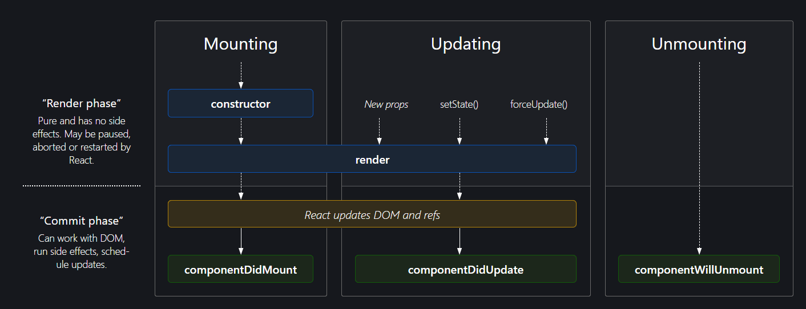
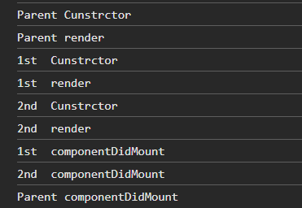

## REACT

### What i studied till now

 - Hello world
 - hello world - using JS
 - hello world - using React & ReactDOM (using CDN)
  (
    `<script crossorigin src="https://unpkg.com/react@18/umd/react.development.js"></script>`
    `<script crossorigin src="https://unpkg.com/react-dom@18/umd/react-dom.development.js"></script>`
  )
  Get CDN links from here (`https://legacy.reactjs.org/docs/cdn-links.html`)
 - We learnt how to bring React on our code
 - We extracted same code on `app.js` file
 - We learnt that any created react element is an object - **h1** (`const h1 = React.createElement(
  "h1",{}, "I am H1")`)
 - And after render it becomes HTML element (`root.render(parent);`)
 - **createElement** takes 3 argument - `React.createElement("h2", {id:"new_h2"}, "Text or child element"),`
   1. Tag
   2. attributes as object
   3. text or child elements
  (If we have to give multiple children we need to pass as an array)
    ```
    React.createElement("div", { id: "child" }, [
    React.createElement("h1", {}, "parent -> child > h1 -> I am h1"),
    React.createElement("h2", {}, "parent -> child > h1 -> I am h2"),
    ])
    ```
  - On `root.render` it is replacing all the previous texts or child of root
  - We can use react just in small portion of our app (like header or footer or even card) 

### Extensions for VSCode -
 
- Prettier
- Bracket Pair Colorization Toggler
- ESLint
- Better Comments
  
### NPM

*npm not stands for Node Package Manager*
(It manages packages for project but not stand like that)

- `npm init` ()
  *This will ask many things*
  - package name (any name of project you are creating)
  - version (default 1.0.0)
  - description (any description)
  - entry point (like app.js)
  - test command (like jest)
  - git repoistory (on my it shows my already added repo - https://github.com/ajaydewangan1100/React_using_CDN_only.git)
  - keywords (any keyword, no need to put)
  - author (name of the person who is working on project)
  - license (ISC) (no need to put)
  - IS this OK? (yes) (enter)
  
### BUNDLER
*Bundeles the app/package *
example
- webpack (use by - create-react-app)
- parcel (easy to configure)
- vite

*I will use `parcel`*, **Comes as a node package**

Process

- `npm install -D parcel` (installed as dev dependencies)

2 types of dependencies are there

  1. **dev dependencies** - require under development
  2. Normal dependencies used in production also


- I can see devDependencies on package.json -
  ```
  "devDependencies": {
    "parcel": "^2.12.0"
  }
  ```
  *On version `^2.12.0` what is the meaning of **caret(^)** symbol*
  *Sometime it will be **tilde(~)** like - `~2.12.0`

  **caret(^)** - with this, npm will automatically do update on package if minor update will come (`2.12.0` -> `2.12.1`)

  **tilde(~)** - with this, npm will automatically do update on package if minor update will come and also for major updates (`2.12.0` -> `3.0.0`)
  
- A file also created - `package-lock.json`
  (This file keeps track of exact version installed on package)
  (*I serached parcel under `package-lock.json` and saw exact version of parcel along with integrity hash*)

- **node-modules** also created contains dependecies/packages which needs for parcel (or we can say parcel also have other dependencies)
  (We call that dependencies - **transitive dependencies**)

- Created a `.gitignore` and put names of files no need to push on github

- we don't need to push node-modules because we can install all dependencies just by running - `npm install`

### Igniting (Bundeling) the app

- `npx parcel index.html` (iginiting using parcel, we need to give source file name)
  - `npm` - means installing the packages
  - `npx` - means executing the package (so here I executed parcel)

- I am able to see on console it gives server url - `Server running at http://localhost:1234`

(Using CDN links on project is bad thing, it can take much time, i have used for `react` and `reactDOM`)
(*So we need to install them*)

### Installing REACT

- `npm install react`
- `npm install react-dom`

*We can see on package.json*
```
"dependencies": {
    "react": "^18.3.1",
    "react-dom": "^18.3.1"
  }
```
- Now I need to remove CDN links added under `index.html` for react and reactDOM and can directly use them from `node_modules`
- I need to import React and ReactDOM - 
  - import React from "react";
  - import ReactDOM from "react-dom"; 
  
- Now after running - `npx parcel index.html` I got an error -
```
Error: Expected content key de1e4a02ec63c4eb to exist

    at nullthrows (F:\react\node_modules\nullthrows\nullthrows.js:7:15)
    at AssetGraph.getNodeIdByContentKey (F:\react\node_modules\@parcel\graph\lib\ContentGraph.js:67:38)
    at F:\react\node_modules\@parcel\core\lib\SymbolPropagation.js:52:82
    at Array.map (<anonymous>)
    at propagateSymbols (F:\react\node_modules\@parcel\core\lib\SymbolPropagation.js:52:61)
    at AssetGraphBuilder.build (F:\react\node_modules\@parcel\core\lib\requests\AssetGraphRequest.js:168:62)
    at async Object.run (F:\react\node_modules\@parcel\core\lib\requests\AssetGraphRequest.js:60:37)
    at async RequestTracker.runRequest (F:\react\node_modules\@parcel\core\lib\RequestTracker.js:633:20)
    at async Object.run (F:\react\node_modules\@parcel\core\lib\requests\BundleGraphRequest.js:103:11)
    at async RequestTracker.runRequest (F:\react\node_modules\@parcel\core\lib\RequestTracker.js:633:20)


```
**SOLUTION** - I solved from this stack overflow page - 
`https://stackoverflow.com/questions/77166144/error-expected-content-key-de1e4a02ec63c4eb-to-exist-getting-this-error-in-reac`

*Auto delete script* -
```
"scripts": {
    "start": "rm -rf .parcel-cache && parcel",
    "build": "rm -rf .parcel-cache && parcel build"
  }
```
*I have updated my package.json script as* -
```
"scripts": {
    "test": "jest",
    "parcel": "rm -rf .parcel-cache && parcel index.html"
  },
```
**Now i can run** - `npm parcel` (It will delete cache file and then run `parcel index.html`)

-  (`@parcel/transformer-js: Browser scripts cannot have imports or exports.`)
  
  
*It is because `<script src="./app.js" ></script>` , saying app.js is normal js code*

**Answer we need to tell it is an module** - (Adding type="module")
`<script type="module" src="./app.js" ></script>`

- Now I am able to see a warning under console -
  

*This warning is because I need to import `ReactDOM` from `react-dom/client`* -> (`import ReactDOM from "react-dom/client";`)

### What parcel doing - 
(Zero config tool)

- Dev build
- Creating local server
- HMR - Hot Module Replacement (for refreeshing the web page)
- This things `parcel` doing by - File Watching Algorithm (Written in c++)
- Caching - Faster builds
- Image Optimization
- Minification of file
- Bundling
- Compressing files
- Consistent hashing ()
- Code spliting
- Differential Bundling (support older browsers also)
- Diagnostics
- Error handling
- HTTPs - (currently hosted on http - can give a way to host app on `HTTPs` )
- Tree Shaking - (Remove unused codes/functions)
- Different DEV and Production Bundle

**Learn Parcel** - [https://parceljs.org/](https://parceljs.org/)

- Now I done Production build with parcel using CMD - `npx parcel build index.html`
  
This commnad gives an error -


**Solution** - Removed `"main": "app.js",` this line from `package.json`
(basically this is conflicting the parcel, because parcel build starts from `index.html`, but `app.js` written under `package.json`)

- Now i run CMD - `npx parcel build index.html`
It created 3 major files under dist folder, (we can see) -


(*Our all project written codes contains by this files*, I can open ansd see that)

- We can give browsers list on `package.json` so our application will definitely work for that browsers

we can add list like this on `package.json`  -

```
"browserslist": [
  "last 2 versions",
  "last 3 Chrome versions",
  "last 5 Firefox versions"
]
```


for that we can use this browsers list *website* - [https://browserslist.dev/](https://browserslist.dev/)

- I have added 2 more script for `start` and `build` -
```
"scripts": {
  "start": "parcel index.html",
  "build": "parcel build index.html",
  "test": "jest",
  "parcel": "rm -rf .parcel-cache && parcel index.html"
}
```

### Starting React Things - FOUNDATION

- I am removing all `app.js` code, currently `app.js` looking like this -
  
```
import React from "react";
import ReactDOM from "react-dom/client";

const root = ReactDOM.createRoot(document.getElementById("root"));

const parent = React.createElement(
  "div",
  { id: "parent" },
  React.createElement("div", { id: "child" }, [
    React.createElement("h1", {}, "parent -> child > h1 -> I am h1"),
    React.createElement("h2", {}, "parent -> child > h1 -> I am h2"),
  ])
);

root.render(parent);

```

- **Starting from Scratch** -
- We already know - `React.createElement => object => html element(rendered)`
  
- **JSX** - (JSX is *not* part of react, Both are separate things)
  - jsx make our life easy
  - JSX is not HTML in JavaScript
  - JSX is HTML like syntax
  - Looks like HTML/XML
  - IT is not pure javascript
  - JS engine does not understand JSX
   (To see it, we can run these line on console - `const jsxHeading = <h1 id="xyz">Heading using JSX</h1>;`)
   (It gives syntax error)

   

  - JSX transpiled before reaches JS engine (converted to code that react can understand)
  - That transpilation done by **PARCEL** using **BABEL**

**BABEL** is a JS compiler /transpiler, 

  - (*BABEL*'s work is to convert `JSX` to `Javascript`)

  - ( **NOTE** - *BABEL is not written by Facebook developers*)

  - Website - [https://babeljs.io/](https://babeljs.io/)
  
  - BABEL is responsible for converting `JSX element` in `React Element`
  
  - (**SO** -> `JSX ELement => Babel transpiles it to React.createElement => object (ReactELement-JS)  => html element (rendered)`)

  - (**Note** - We need to use camelCase for JSX attributes);
  - (*Use brackets to write JSX of multiline* - `( <h1> Multiline JSX here </h1> )`)

### React Component -

- Everything in React is component
- 2 Types 
  - Class based component - OLD
  - function component - NEW
  
**function component** 

  (*Normal JS function, which returns some JSX or React Element*)

    ```
      <!-- Syntax 1 -->
      const FunCompHeading = () => {
        return <h1>Heading - using Function Component</h1>;
      };

      <!-- Syntax 2 (without return keyword) -->
      const FunCompHeading = () => <h1>Heading - using Function Component</h1>;
    ```

  - Let's create and render functional component - 

    ```
    const FunCompHeading = () => {
      return <h1>Heading - using Function Component</h1>;
    };

    console.log(jsxHeading);

    const root = ReactDOM.createRoot(document.getElementById("root"));

    root.render(<FunCompHeading />);
    ```

- **Component compositoin or Nested component** -

  ```
  const FuncHeading = () => <h1 id="xyz">This is Component compositoin</h1>;

  const FunCompHeading = () => {
    return (
      <div>
        <FuncHeading />
        <h1>Heading - using Function Component</h1>
      </div>
    );
  };

  const root = ReactDOM.createRoot(document.getElementById("root"));
  root.render(<FunCompHeading />);
  ```

- **Ways to render a component** -
  
  - `<FuncHeading />`
  - `<FuncHeading></FuncHeading>`
  - `{FuncHeading()}`


### Started Food Ordering App

- AppLayout component created
- Header component created
- Body component created

### Config driven UI (used by swiggy)
 - Constrolling the UI using DATA(config) 
 - config comes from backend
 - Latest practice following by multiple big companies
  

### Project Cleanup

  - Updated Restaurant Card with loop
  - Created different components
  - Creating components with `.js` extension
  - importing components without extension - `import Header from "./components/Header";`
  - Never keep **hard coded data under component file**
  - So creatred a `utils folder`, under that created a `constant.js` file for separating data 
  - separated *DUMMY JSON DATA* - 
  - and also links used for image or CDN images

### React Hooks start

  - Normal JavaScript Utility Functions
  - Written by Facebook Developers
    
  #### useState Hook - 

    Creates Superpowerful state variables 

    - Scope inside component in which the state created
    - *Note* - Never create state variables outside of the component
    - Always put state variables on top of the component, (good practice) and React also understand because it's consistency
    - Never create state varible inside conditional (if else)
    - or inside loop
    - or function 


**React Features**

  **Reconciliation Algorithm (React Fiber)** 

    **Virtual DOM**

      - Object representation of Actual DOM
      - Normal JS Object
      - can see that using - `console.log(<Header />)`

    **Diff Algorithm**

      - Tries to find difference between old virtual DOM and new virtual DOM
      - Then it will update actual DOM with new virtual DOM 
    

**Different terms used in world**

  **Monolith Architecture**

    - All Services and features created under single project
    - Like - backend, UI, Auth, Email etc
    - If single feature needs update, then need to push whole project again along with all features and services
    - So it's too bulky

  **Microservices**

    - Different services for different features
    - Together forms big app
    - Each and small thing it ca have different projects
    - **This is known as separation of concerns**
    - We can have different tech stack for different features/services
    - All services run their own specific PORT
    - All PORTS map to Domain Name

**2 Approaches to fetch DATA from backend**

  1. As soon as page load fetch the data, when we get data then render it on UI
  2. As soon as page load render the UI, now fetch data and after data come re-render UI with data
     
  In REACT always have to use 2nd approach
  (Because 2nd is better approach and gives better UX)

#### useEffect Hook -

   - Comes from REACT library
   - syntax - useEffect(() => {}, []) 
   - arguments to pass - (callback function and dependencies array)
   - This call function is called after component is loaded or rendered

   - I am trying ot fetch swiggy data from Swiggy API, using useEffect
     
   ```
   useEffect(() => {
     fetchData();
   });

   const fetchData = async () => {
     const data = await fetch(SWIGGY_API);
     const jsonData = await data.json();
     console.log(jsonData);
   };
   ```
   - But i am getting CORS error 
   - when is this `useEffect` call
   - **`useEffect` will be called every time component will be rendered**
  
  **Conditions based on dependency array**
   - If no dependency array - `useEffect` will be called on **every render**
   - if empty dependency array `[]` - `useEffect` is called on initial render **just once**
   - if dependency array contains state variable `[searchText]` - `useEffect` will be called every time when **state variable's** values changes


**CORS**
     
  

   - because my browser is blocking to access API from localhost (form one origin to another)
   - When origin mismatch browser blocks that API call
   - That is a CORS policy
   - Bypass the CORS

   - Intall CORS extension and enable it

   

   - if we don't want to use the CORS extension
   - we can goto - []()

**Optional Chaining** 

  - I have used for extracting exact data i want - `data?.cards[4]?.card?.card?.gridElements?.infoWithStyle?.restaurants`

**Loader**

  - I am able to see white section before fetching done by API
  - So I want to show a Loader instead
  - But showing loader is not good practice and also not industry practice
  - So I will use **Shimmer UI**
  
**Shimmer UI** 

  - `Shimmer is a temporary animation placeholder for when data from the service call takes time to get back and we don't want to block rendering the rest of the UI`.
  - For that i have created a `Shimmer.js` and created a skeleton
  - given a condition under `Body.js`
  
  ```
    if (restaurantList.length === 0) {
      return <Shimmer />;
    }
  ```

  (**Above condition is also known as `Conditional Rendering`**)

  - We can also write it using `turnery operator `

    ```
    return restaurantList.length === 0 ? (
        <Shimmer />
      ) : ()
    ```

  - I have created a search input, binded with state varible

  **NOTE** `Whenever state variable updates, REACT triggers a reconciliation cycle (re-renders) of that component where the state variable present`


**Multiple Pages on my project**

### React Router

- *Website*- [React Router](https://reactrouter.com/en/main)
- I will use latest version - which is `6.4` at that time
- Intalled - npm i react-router-dom

- **Routing configuration** 

    *Navigation between pages*

- **createBrowserRouter** 
  - `import { createBrowserRouter } from "react-router-dom"`
  - it takes a list of routes/path (basically objects)

  ```
    const appRouter = createBrowserRouter([
    {
      path: "/",
      element: <AppLayout />,
    },
    {
      path: "/about",
      element: <About />,
    },
  ]);
  ```
  
  - Now I created a configuration,
  - But I also need to provide it to render it
  - for that we need - **RouterProvider**

- **RouterProvider**

 - Import - 
 - `import { createBrowserRouter, RouterProvider } from "react-router-dom";`
 - How to provide -
 - `root.render(<RouterProvider router={appRouter} />);`

- **Creating my own error page**

  ```
    const Error = () => {
      return (
        <div>
          <h1>OOP's</h1>
          <h2>Something went wrong</h2>
        </div>
      );
    };

    export default Error;
  ```

- and adding it to the router configuration

  ```
    {
      path: "/",
      element: <AppLayout />,
      errorElement: <Error />,
    },
  ```

- Added here for `AppLayout component`

- **NOTE** - React Router Dom gives us access to important *hook* on *Error cases* 

- **useRouteError** 
- Using the hook we can give more details and bettor error
- Import - `import { useRouteError } from "react-router-dom";`
- Call - `const err = useRouteError();`

  ```
    import { useRouteError } from "react-router-dom";

    const Error = () => {
      const err = useRouteError();
    //   console.log(err);

      return (
        <div>
          <h1>OOP's</h1>
          <h2>Something went wrong</h2>
          <h3>
            {err.status}: {err.statusText}
          </h3>
        </div>
      );
    };

    export default Error;
  ```


  - **Childern routes**
   - Now i have a problem, when I am going to contact Us page or About Us page my header I need to show
   - For that I can give childrens as a list of objects contains components, 
   - which we want to render as child
   - So I have to change things 
  
    - Import `Outlet` component from `react router dom` 
    - `import { createBrowserRouter, Outlet, RouterProvider } from "react-router-dom";`
    - *Outlet is like a presentator for different childs, it can render childs based on path*
    - *It replaces itself by child component*
  
    - *Router configuration updated*

    ```
      const appRouter = createBrowserRouter([
        {
          path: "/",
          element: <AppLayout />,
          errorElement: <Error />,
          children: [
            { path: "/", exact: true, element: <Body /> },
            {
              path: "/about",
              element: <About />,
            },
            {
              path: "/contact",
              element: <Contact />,
            },
          ],
        },
      ]);
    ```

    - See `AppLayout` - 

    ```
      const AppLayout = () => {
        return (
          <div className="app">
            <Header />
            <Outlet />
          </div>
        );
      };
    ```


  - **Creating links**
    - We need to navigate between pages by clicking on navigation links
    - We have nav links under `Header` component
    - In React we can't use `<a>` *Acnhor tag*
    - Beacuse it reloads the page
    - We need to navigate to new page without reloading the whole page
      
  - **Link** 
    - import - `import { Link } from "react-router-dom";`
    - USE - `<Link to="/about">About US</Link>`
    - 

  - **@ Tyoes of routing in web apps**
    1. Client Side Routing
      - I have created cliend side routing on my application
      - Because nothing is fetched when clicking on the navigation links
      - So we can call it SPA (Single Page Application) also
    2. Server Side Routing
      - On click of nacigation links it creates a network call to download the page 
      - and page comes from server then it renders that page
  
  - **Creating Dynamic pages**
    - Now i want to create dynamic page based on the restaurant menu
    - When I will click any restaurant it will show its full details on the new page
    - For that I am creating a new path - 

    ```
      {
        path: "/restaurants/:resId",
        element: <ReastaurantMenu />,
      }
    ```

  - Dynamic Menu page created
  - But only 1 restaurant menu is coming because API is hardcoded
   
  - **useParams**
    - To get things which sent in URLs
    - import - `import { useParams } from "react-router-dom";`
    - USE - `const params = useParams();`
    - It returns an object with params keys present on URL
     
    - 
    
    - constant variable - `constant.js`
     
      ```
        export const RES_MENU_FETCH_API = [
          "https://www.swiggy.com/dapi/menu/pl?page-type=REGULAR_MENU&complete-menu=true&lat=18.5204303&lng=73.8567437&restaurantId=",
          "&catalog_qa=undefined&submitAction=ENTER",
        ];
      ```

    - `RestaurantMenu.js` -

      ```
      const data = await fetch(
        RES_MENU_FETCH_API[0] + params.resId + RES_MENU_FETCH_API[1]
      );
      ```
    
    - **Create clickable Restaurant cards**
      - So we can click on card and go to its info page
      - And can get `id` dynamically for that restaurant
      - Using that `id` only I need to get that restaurant info
      - And that `id` I will get from URL using useParams 

      - Using `Link` tag I have done - 
        ```
          <Link key={c_data.info.id} to={"/restaurant/" + c_data.info.id}>
            <RestrourantCard resData={c_data} />
          </Link>
        ```

      - How I am passing id, we can see - `to={"/restaurant/" + c_data.info.id}`

      - I have to use this logic for get list of restaurants

        ```
          let [FIND] =
          resInfo?.data?.cards[4]?.groupedCard?.cardGroupMap?.REGULAR?.cards.filter(
            (crd) => crd.card.card.title === "Recommended"
          );

        const itemCards = FIND && FIND.card?.card.itemCards;
        ```

### Class Components

  - Most of the time interviewer will ask Class Components, so we need to learn it
  
  - I'ill utilize `About Us` page for that 
  - I will add information of some persons 
  - Its a normal Javascript Class
  - Which we will use for create a component
  - **Syntax**
    - `class <NameOfComponent> extends React.component{}`
    -  class must have a render Method, which will be called
    -  And that render method will return some JSX things.

    ```
      class UserClass extends React.Component {
        render() {
          return (
            <div className="user-card">
              <h2>NAme: Ajay</h2>
              <h3>Location : Pune</h3>
              <h4>Contact : @ajaydewangan1100</h4>
            </div>
          );
        }
      }

      export default UserClass;
    ```

    - Now I need to pass `props`, which i can do same like functional comp
    - `<UserClass name={"Ajay (fucntion)"} />`
    - But receiving arguments is different from functional component
    - I need to use `cunstructor method` for recieve the `props`
    - Under that `cunstructor method`, we need to use `super method`

     ```
      constructor(props) {
        super(props);

        console.log(props);
      }
    ```

    - **State Varible Under Class component**
    - **Note** when we `Class component` renders it creates an instance of the class,
    - so it calls constructor, and basically that time it takes parameters
    - So under cunstructor method it is best place to create state also,
    - But we can't use `useState` for state variable, 
    - as we know hooks works with components only, outside component it won't work,
    - and hooks came with functional components 
    - before that there is different method to create state under `Class Component`

      ```
        constructor(props) {
          super(props);
          // console.log(props);
          this.state = {
            count: 0,
            count2: 2,
          };
        }
      ```
    - *use of the state variable* -
    
      ```
        <h1>Count : {this.state.count}</h1>
        <h1>Count2 : {this.state.count2}</h1>
      ```

    - *Updating the state variable* - `Inside Class Component`
      
      ```
        onClick={() => {
            this.setState({
              count: this.state.count + 1,
              count2: this.state.count2 + 2
            })
          }}
      ```

  - **Component Lifecycle Method**

  - Loading/Mounting - same
  - Whenever Class component is instantiated cunstrutor method called 
  - Then render method is called
  - How lifecycle method is called - `Cunstructor() > Render() > componentDidMount()`
  - `componentDidMount()` - Used to make API call
    

    ```
      - Parent - Cunstructor method
      - parent - Render method

        - 1st child - Cunstructor method
        - 1st child - Render method

        - 2nd child - Cunstructor method
        - 2nd child - Render method  

        <DOM updated - in single batch>

        - 1st child - ComponentDidMount
        - 2nd child - ComponentDidMount

      - Parent - ComponentDidMount
    ```

  - DOM manipulation is very expensive thing so React first render then do DOM manipulation in commit phase

    

  - Follow this website explaination for Lifecycle Method 
    - [https://projects.wojtekmaj.pl/react-lifecycle-methods-diagram/](https://projects.wojtekmaj.pl/react-lifecycle-methods-diagram/)
  
  - React tries to batch childs DOM and ComponentDidMount(),
  - that's one reason React is Fast

  - Output on console
   
    

  
  
  - I have created a video how Lifecycle Method works on my this project, 
  - and attached here as zip, so i can see in fufure
  
    [React Component Life Cycle Explained in video - zip file](<Learning_related_media/React Component Life Cycle Explained in video.zip>)